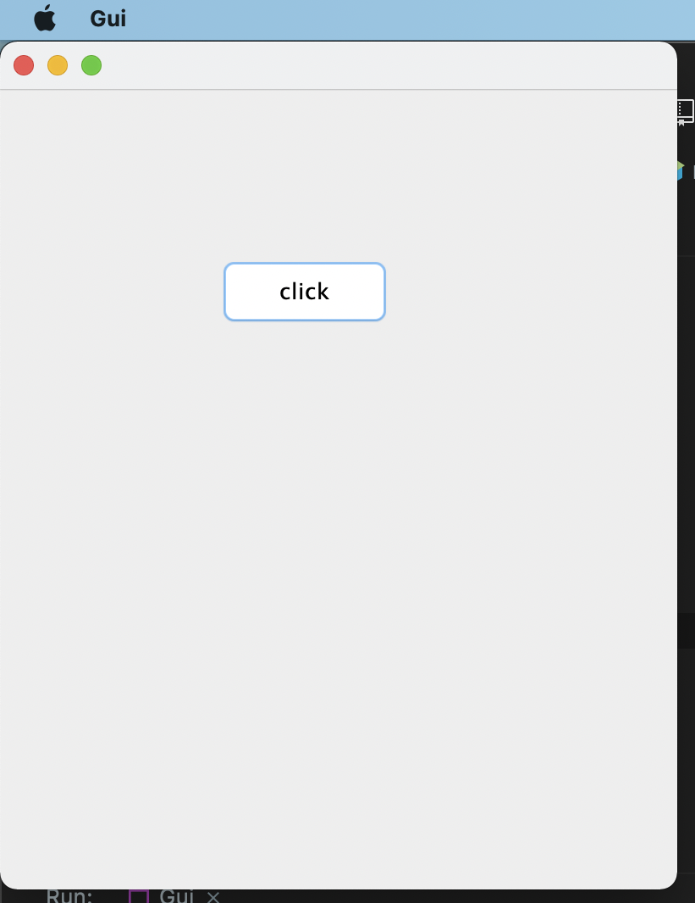

# GUI @ Angel

Hello and good day, the work ahead is not easy.

The GUI framework used is `swing` which is already in the library and makes your work easier.

Visit the page @ https://www.javatpoint.com/java-swing for a tutorial.

I've set up a small GUI example, which Intellij should highlight and on clicking you should
see a small Graphical user interface pop up. 
Looks like

From then on you are as free as the bird to go create whatever interface is needed for

data input and whatever is needed for data output.

There will be two interfaces mainly.

## 1. GUI's that accept data.

E.g a GUI that allows one to enter patient details, Doctors details e.t.c.

## 2. GUI's that show data.

E.g a GUI that will show the result of a database query.

If 5 entries have been entered for Doctors available, there should be a GUI that can show 
which of these doctors are available.

You will push and consume data from Michael, you should probably be 
besties for the best relations.

With Love 🤍🤍 @ CAE